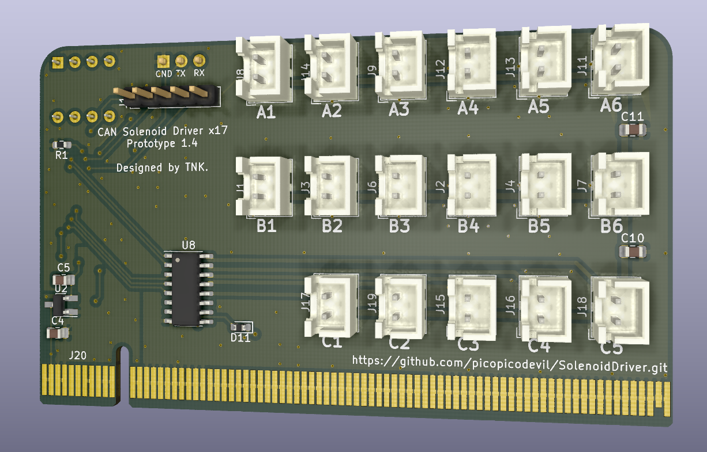
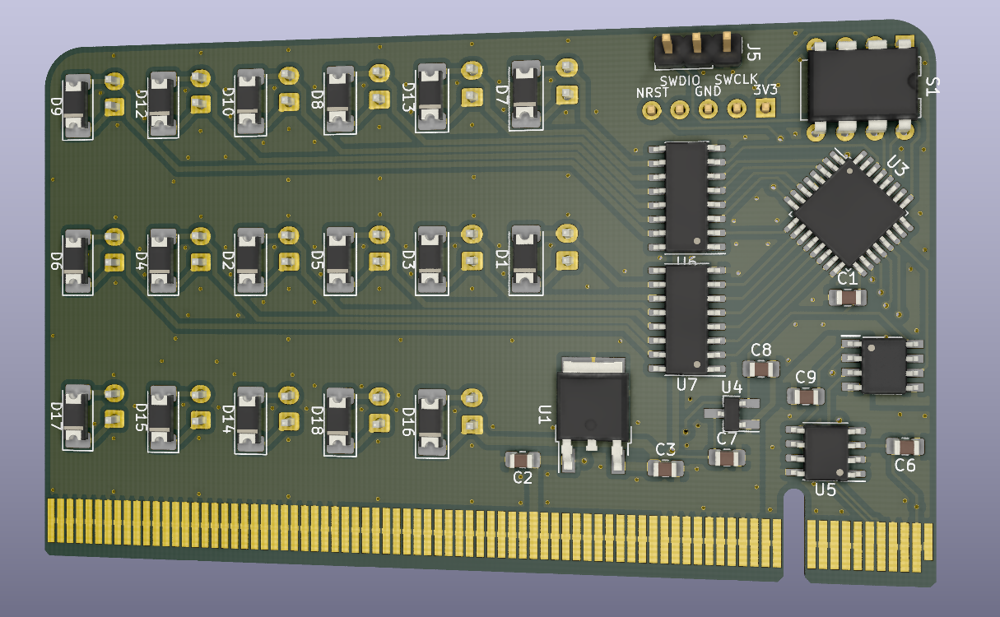

# SolenoidDriver

### 表

### 裏

## 概要
独自にピン定義したPCIeを使ったソレノイド駆動回路です。

最大17個のソレノイドを接続と駆動ができます。(17個も駆動させない場合は、A-Cのうち使用する行に接続されているダーリントントランジスタやその他部品のみ実装し、動作させることも可能です。)

作成しているモータードライバ([CAN-H-Bridge_Solo_MD](https://github.com/picopicodevil/CAN_H-Bridge_Solo_MD))とほぼ同じ大きさなので、同一のマザーボードの中にモータードライバと本基板を入れることが可能です。

## 機能
- CAN通信を用いたソレノイドの制御
- DIPスイッチを利用して、同じプログラムで同一CANバスに最大4つ搭載可能
- ディジタルアイソレータを用いた制御-駆動電源の分離
